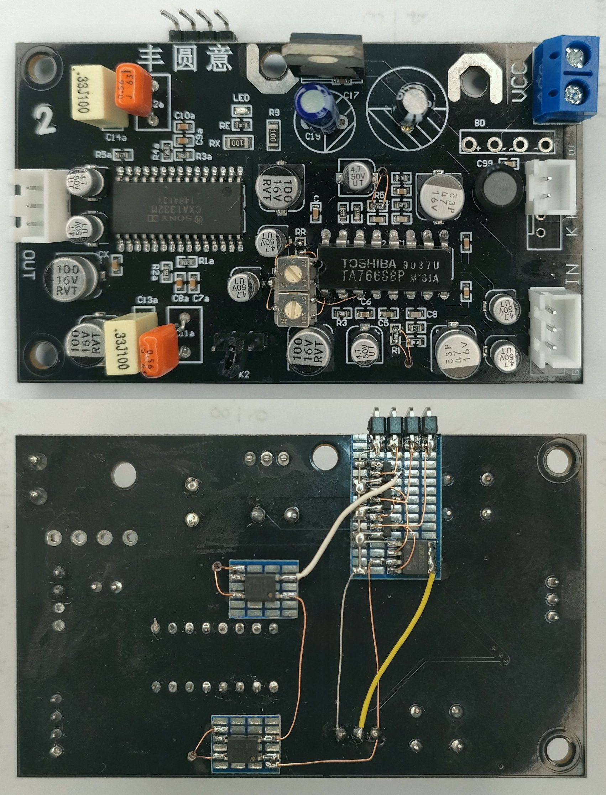

# Raspberry Pi Pico CRP42602Y mechanism control

## Single PB deck project
* support single deck (play back only)
* control by 5 Way Switch + 2 Buttons and serial interface
* support EQ and NR control
* support real-time counter (if enabled by GP28)

### Notes about real-time counter
* Not to lose time information, FF or REW command without previous Play command makes the insersion of Play command in short time

## Supported Board and Peripheral Devices
* Raspberry Pi Pico (rp2040)
* CRP42602Y mechanism
* TA7668BP + CXA1332M board with customization
* SSD1306 128x64 OLED display
* [KCX BT EMITTER V1.7](doc/KCX_BT_EMITTER_V1.7.jpg) (Bluetooth Transmitter)

## Pin Assignment & Connection
### CRP42602Y circuit
| Pico Pin # | GPIO | Function | Connection |
----|----|----|----
| 4 | GP2 | GPIO Output | to SOLENOID_CTRL of additional circuit (0: release, 1: pull) |
| 5 | GP3 | GPIO Input | CASSETTE_DETECT from CRP42602Y pin 7 |
| 6 | GP4 | GPIO Input | GEAR_STATUS_SW from CRP42602Y pin 3 |
| 7 | GP5 | GPIO Input | ROTATION_SENS from CRP42602Y pin 2 |
| 8 | GND | GND | GND |
| 9 | GP6 | GPIO Output | to POWER_CTRL (0: disable, 1: enable) |
| 16 | GP12 | GPIO Input | REC_A_SW from CRP42602Y pin 8 (reserved) |
| 17 | GP13 | GPIO Input | REC_B_SW from CRP42602Y pin 1 (reserved) |

### Real-time counter
| Pico Pin # | Pin Name | Function | Description |
----|----|----|----
| 34 | GP28 | GPIO Input | REALTIME_COUNTER_SEL (Open: OFF, L: ON) |

### EQ and NR control with additional circuit
| Pico Pin # | GPIO | Function | Connection |
----|----|----|----
| 10 | GP7 | GPIO Output | to EQ_CTRL (0: 120us, 1: 70us) |
| 13 | GND | GND | GND |
| 14 | GP10 | GPIO Output | to NR_CTRL0 (0: Dolby B, 1: Dolby C) |
| 15 | GP11 | GPIO Output | to NR_CTRL1 (0: NR ON, 1: NR OFF) |
| 19 | GP14 | GPIO Output | to EQ_MUTE (0: Mute OFF, 1: Mute ON) |

### Bluetooth Tx Module
| Pico Pin # | Pin Name | Function | Description |
----|----|----|----
| 20 | GP15 | GPIO Output | to BT_TX_CONNECT (Bluetooth Tx Module Connect Push Button) |
| 21 | GP16 | GPIO Output | to BT_TX_POWER (Bluetooth Tx Module Power Enable) |

### SSD1306
| Pico Pin # | Pin Name | Function | Connection |
----|----|----|----
| 11 | GP8 | I2C0 SDA | to/from SSD1306 SDA |
| 12 | GP9 | I2C0 SCL | to/from SSD1306 SDA |

### 5 Way switch + 2 buttons
| Pico Pin # | Pin Name | Function | Connection |
----|----|----|----
| 23 | GND | GND | COM |
| 24 | GP18 | GPIO Input | UP |
| 25 | GP19 | GPIO Input | DOWN |
| 26 | GP20 | GPIO Input | LEFT |
| 27 | GP21 | GPIO Input | RIGHT |
| 29 | GP22 | GPIO Input | CENTER |
| 31 | GP26 | GPIO Input | SET |
| 32 | GP27 | GPIO Input | RESET |

## Schematic
### Control circuit schematic
[CRP62402Y_ctrl_with_buttons_schematic](doc/CRP62402Y_ctrl_with_buttons_schematic.pdf)

### EQ NR board (customized)
Two options are available from following boards.
* TA7668BP_CXA1332M customized board

[TA7668BP_CXA1332M customized board schematic](doc/TA7668BP_CXA1332M_board_customized.pdf)

* Discrete EQ plus CXA1332M board

[Discrete EQ plus CXA1332M board schematic](doc/Discrete_EQ_plus_CXA1332M_board.pdf)

## Button operation
Note: 5 Way switch is supposed to be mounted as -90 degree rotated. (UP switch works as left direction)
* CENTER: play/stop (single click), reverse play (double click), bluetooth connect (triple click), bluetooth on/off (long push)
* DOWN (right): fast forward
* UP (left): rewind
* RIGHT (up): direction A/B (single push), save flush (long push)
* LEFT (down): reverse mode (single push), reset counter (long push)
* RESET: EQ select
* SET: NR select

## Serial interface operation
* 's': stop
* 'p': play
* 'q': reverse play
* 'f': fast forward
* 'r': rewind
* 'd': direction A/B
* 'v': reverse mode
* 'e': EQ select
* 'n': NR select
* 'c': reset counter